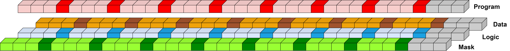
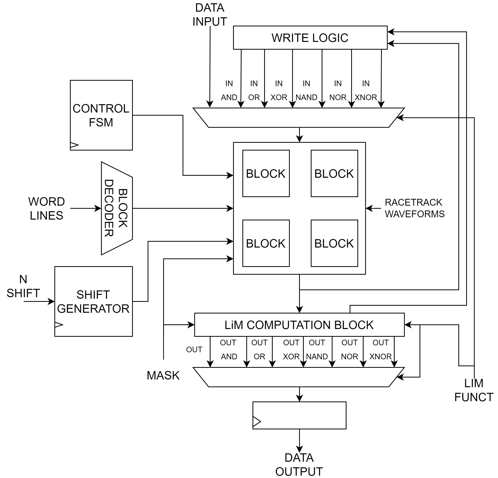
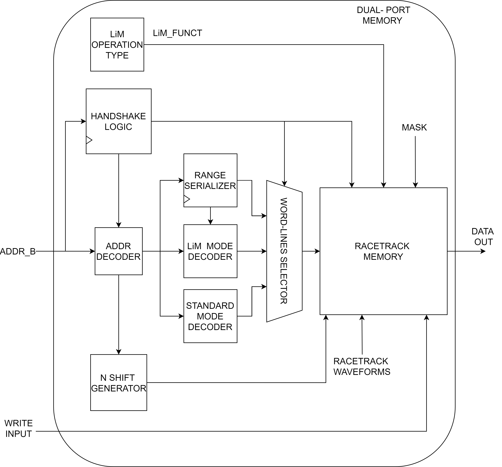
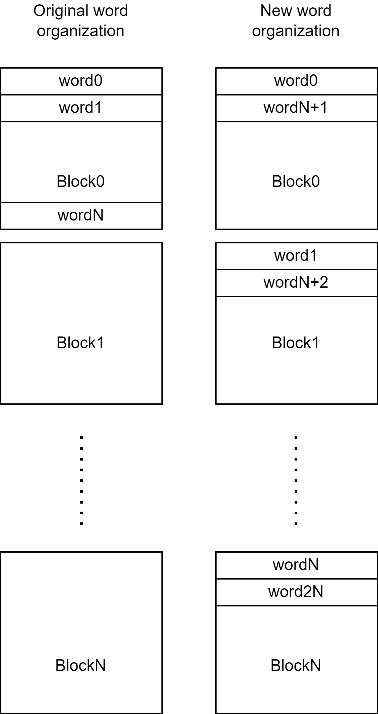

Racetrack memory RTL model
==========================
This folder contains all the RTL files of the Racetrack memory

Memory organization
--------------------------
In the following a biref insight of hierarchical architecture of the memory will be given.
The Racetrack memory array is composed by multiple basic elements called Blocks, the required number of Blocks is istantiated automatically based on the memory size, `RT_memory` intantiates the required number of Blocks based on the memory parameters.
Each block is composed by multiple `Macro Units` 32x32 bits entities composed composed by several pNML Racetracks, file `RT_block` instantiates the required number of Macro Units based on the memory parameters. Hierarchically, file `RT_32_8_4_MU` instantiates all the required pNML Racetracks.
The pNML Racetrack has a 3D structure composed by three different Racetracks:
* Logic Racetrack : computes and stores LiM results
* Data Racetrack : stores standard Data
* Mask Racetrack : stores Mask values
* Program Racetrack : stores program bit 

File `RT_32_8_4_line` instantiates all the basic Racetrack cells (`pNML_NAND_NOR`, `pNML_NAND_NOR_SOT`, `RT_cell`, `RT_read_write_SOT`) for each of the four different Racetracks.

Memory architecture
--------------------------
The Racetrack array is instantiaed in `RT_memory` which wraps the raw memory core and adds surrounding logic for the correct functioning. Here `FSM` and `shifter` entities are instantiated. This modules includes also all the logic required for the LiM computations.

The Racetrack memory is instantiated by `dp_ram_logic`, which provides all the additional logic (i.e. decoders, shift number generator etc.).

Word organization
--------------------------
The Racetrack memory is capable of parallel LiM store operations by performing parallel accesses in each Block. This feature requires a different word organizayion within the memory.

